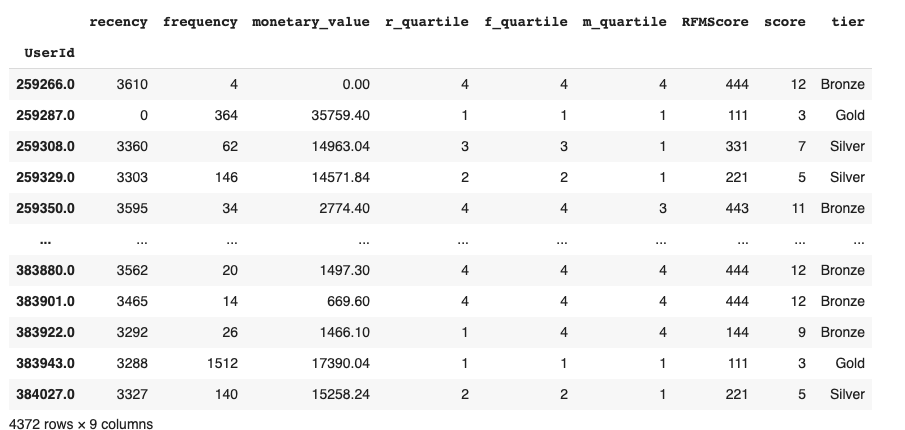

# RFM-Segmentation

**PROBLEM STATEMENT**

Explore and identify different segments present in the customer transaction data.

**SOLUTION**

Performed RFM segmentation of customer transaction data.

**WORKFLOW**

1. Calculated Total_Transaction value from given dataset by excluding null values.

2. Derived unique customers and group them by country and their Total_transaction.

3. From TransactionTime extracted the timestamps.

4. By deriving the last and most recent dates, calculated the RFM scores.

5. Performed the customer wise segmentation using RFM scores.

6. Combined the RFM scores and segments users into different tiers.
    (i.e. Bronze, Silver, Gold)

**CONCLUSION**

Conducting an RFM analysis on your customer base and sending personalized campaigns to high value targets has massive benefits for your eCommerce store.

1.Personalisation:  By creating effective customer segments, you can create relevant, personalized offers.
2. Improve Conversation Rate: Personalized offers will yield higher conversion rates because your customers are engaging with    products they care about. 
3. Improve unit economics
4. Increase revenue and profits
